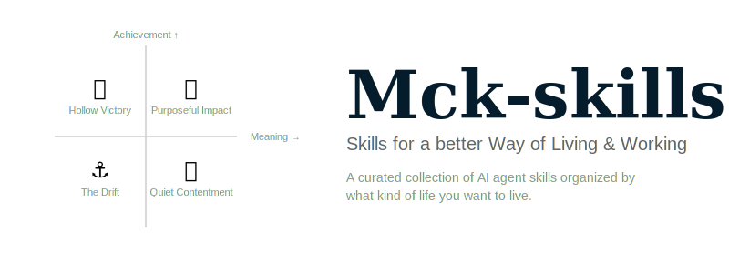

<div align="center">



<br>
<br>

<p>
  <sup>
    <a href="PHILOSOPHY.md">Our Philosophy</a>&nbsp;&nbsp;&nbsp;
    <a href="CONTRIBUTING.md">Contributing Guide</a>&nbsp;&nbsp;&nbsp;
    <a href="template/skill-template/">Skill Template</a>
  </sup>
</p>

<br>

<p>
  <b>A curated collection of AI agent skills organized by what kind of life you want to live.</b>
</p>

<p>
  <sub>Most skill galleries organize by technology. We organize by meaning.<br>
  Built for consultants, strategists, and builders who refuse to choose between achievement and meaning.</sub>
</p>

<br>

<a href="https://awesome.re"></a>

</div>

<br>

## Why This Exists

Every skill gallery out there optimizes for **doing more, faster**. We've all been there — the hamster wheel of productivity, cranking out decks at 2am, mistaking motion for progress.

**Mck-skills** is organized around a different question:

> *"Does this skill help me achieve more, find more meaning, or — ideally — both?"*

We call this the **Meaning-Achievement Matrix** — a 2×2 framework that maps every skill to the kind of life it helps you build.

## The Framework

```
                        High Achievement
                              ▲
                              │
              ┌───────────────┼───────────────┐
              │               │               │
              │  🐹 HOLLOW    │  🚀 PURPOSEFUL│
              │   VICTORY     │    IMPACT     │
              │               │               │
              │  Run faster,  │  Build what   │
              │  feel less.   │  matters.     │
              │               │               │
   Low ───────┼───────────────┼───────────────┼──── High
   Meaning    │               │               │    Meaning
              │  ⚓ THE DRIFT │  🕯️ QUIET     │
              │               │  CONTENTMENT  │
              │  Lost at sea. │               │
              │               │ Simple riches.│
              │               │               │
              └───────────────┼───────────────┘
                              │
                              ▼
                        Low Achievement
```

## Contents

- [🐹 Hollow Victory](#-hollow-victory)
- [🚀 Purposeful Impact](#-purposeful-impact)
- [⚓ The Drift](#-the-drift)
- [🕯️ Quiet Contentment](#️-quiet-contentment)

## 🐹 Hollow Victory

*High Achievement × Low Meaning — "Run faster, feel less."*

You're crushing it at work. The decks are perfect, the models are tight, the clients are impressed. But Sunday nights fill you with dread. These skills **automate the mechanical**, freeing you from the hamster wheel so you can invest time in what actually matters.

- [McKinsey PPT Design](skills/hollow-victory/mck-ppt-design/) - Create consultant-grade PowerPoint presentations from scratch with a comprehensive design system. `✅ Production`
- [McKinsey Chart Design](skills/hollow-victory/mck-chart-design/) - Generate FT/Economist editorial chart Midjourney prompts with cold-palette line charts and annotation-driven narratives. `✅ Production`
- [Professional Speech](skills/hollow-victory/professional-speech/) - Structure compelling presentations and talking points using Pyramid Principle, SCQA, and Minto frameworks. `✅ Production`
- [WorkBuddy PPT Engine](skills/hollow-victory/workbuddy-ppt-engine/) - Python-pptx automation engine with McKinsey design system, 16+ layout patterns, and corruption defense. `✅ Production`
- [Data Model Builder](skills/hollow-victory/data-model-builder/) - Financial model scaffolding and sensitivity analysis. `🔜 Planned`
- [Client Email Craft](skills/hollow-victory/client-email-craft/) - Professional client communication with consulting-grade templates. `🔜 Planned`

## 🚀 Purposeful Impact

*High Achievement × High Meaning — "Build what matters."*

The north star. These skills help you channel your consulting superpowers into work that **matters to you** — side projects, ventures, community building.

- [Venture Canvas](skills/purposeful-impact/venture-canvas/) - Lean Canvas and market sizing for side ventures. `🔜 Planned`
- [Community Builder](skills/purposeful-impact/community-builder/) - Design and grow communities with flywheel thinking. `🔜 Planned`
- [Strategy Storyteller](skills/purposeful-impact/strategy-storyteller/) - Turn complex strategy into compelling narratives. `🔜 Planned`
- [Impact Measurement](skills/purposeful-impact/impact-measurement/) - OKR/KPI frameworks for meaningful projects. `🔜 Planned`
- [Open Source Launch](skills/purposeful-impact/open-source-launch/) - Launch and grow an open-source project end to end. `🔜 Planned`

## ⚓ The Drift

*Low Achievement × Low Meaning — "Lost at sea."*

We've all been here. Doom-scrolling between meetings. Procrastinating on that deck because nothing feels worth doing. These skills provide **structure and momentum** when you've lost your compass.

- [Weekly Compass](skills/the-drift/weekly-compass/) - Weekly planning ritual with energy and priority mapping. `🔜 Planned`
- [Decision Journal](skills/the-drift/decision-journal/) - Structured decision logging to build self-awareness. `🔜 Planned`
- [Learning Path](skills/the-drift/learning-path/) - Curated skill-building roadmaps with accountability. `🔜 Planned`
- [Focus Session](skills/the-drift/focus-session/) - Deep work session design with Pomodoro and context loading. `🔜 Planned`

## 🕯️ Quiet Contentment

*Low Achievement × High Meaning — "Simple riches."*

Not everything needs to be a KPI. Sometimes the best ROI is a perfectly brewed coffee, a journal entry, or an afternoon with no agenda. These skills support **the life around the work**.

- [Reading Digest](skills/quiet-contentment/reading-digest/) - Summarize and annotate books, articles, and podcasts. `🔜 Planned`
- [Reflection Prompt](skills/quiet-contentment/reflection-prompt/) - Daily and weekly reflection using consulting frameworks. `🔜 Planned`
- [Life Dashboard](skills/quiet-contentment/life-dashboard/) - Personal KPI tracker beyond work metrics. `🔜 Planned`
- [Gift Curator](skills/quiet-contentment/gift-curator/) - Thoughtful gift ideas based on relationship context. `🔜 Planned`

## Quality Tiers

| Badge | Tier | Criteria |
|-------|------|----------|
| `✅ Production` | Battle-tested | Used in real consulting engagements, refined through iterations |
| `🧪 Beta` | Functional | Core logic works, actively collecting feedback |
| `🔜 Planned` | Roadmap | Designed but not yet implemented — PRs welcome! |

## Quick Start

### Install a skill

```bash
# Copy SKILL.md into your Claude skills directory
cp -r skills/hollow-victory/mck-ppt-design/ ~/.claude/skills/

# Or clone the whole gallery
git clone https://github.com/kaku-git/mck-skills.git
```

### Use a skill

Each skill folder contains:

```
skills/[quadrant]/[skill-name]/
├── SKILL.md    # Machine-readable skill definition (YAML frontmatter + instructions)
├── README.md   # Human-readable documentation
├── scripts/    # Optional: helper scripts
└── examples/   # Optional: example inputs/outputs
```

Copy the `SKILL.md` into your AI agent's skill directory and it will be automatically activated based on the trigger conditions defined inside.

## For Consultants, By Consultants

This isn't a generic skill library. Every skill is designed with the **consulting mindset**:

- **Structured thinking** — MECE, hypothesis-driven, issue trees
- **Visual precision** — McKinsey/BCG/Bain design standards
- **80/20 focus** — Automate the 80% that's mechanical, invest in the 20% that's creative
- **Storytelling** — Every output tells a story, not just presents data
- **Time-boxed** — Respects that your time is literally billed by the hour

## Contributing

We'd love your skills! See the [Contributing Guide](CONTRIBUTING.md) for the full walkthrough.

**Quick version:**

1. Fork this repo
2. Pick a quadrant — which part of the matrix does your skill serve?
3. Use the [template](template/skill-template/) — `cp -r template/skill-template/ skills/[quadrant]/[your-skill]/`
4. Write your `SKILL.md` following the [spec](template/skill-template/SKILL.md)
5. Submit a PR — we review within 48 hours

**Have an idea but no code?** Open an [Issue](../../issues) with the skill-idea template.

## Roadmap

- [x] Core Hollow Victory skills (PPT, Charts, Speech, Engine)
- [ ] Gallery website with interactive matrix visualization
- [ ] Purposeful Impact skills launch
- [ ] Community-contributed skills across all quadrants
- [ ] Skill chains — combine skills into workflows

## Philosophy

> *"The consulting industry produces incredibly capable people who are often deeply unfulfilled. We built Mck-skills to help bridge that gap — not by working less, but by working on what matters."*

Read the full [Philosophy →](PHILOSOPHY.md)

## License

[MIT](LICENSE) — Use freely, build boldly, live meaningfully.

<br>

<div align="center">
  <sub>Made with ❤️ by consultants who believe there's more to life than billable hours.</sub>
</div>
